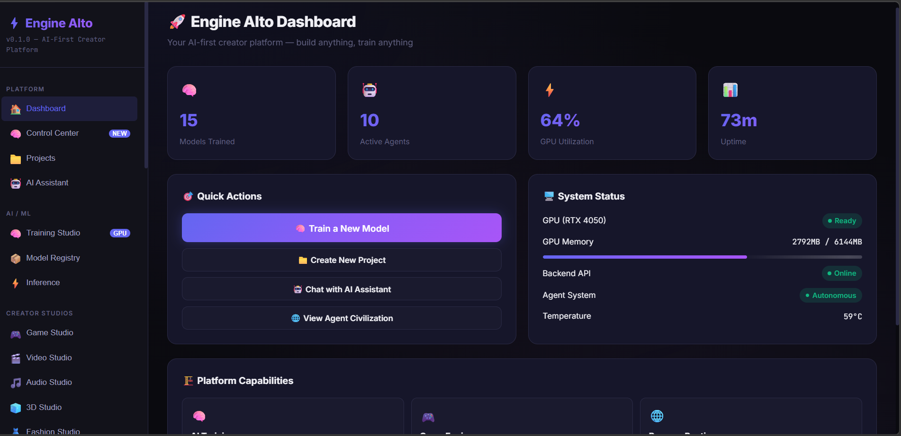

<div align="center">

# ⚡ SuperBuilder / Engine Alto

### The Open-Source AI Creation Platform

[](LICENSE)
[](https://github.com/rupac4530-creator/super-builder-platform/stargazers)
[](https://github.com/rupac4530-creator/super-builder-platform/network)
[](https://github.com/rupac4530-creator/super-builder-platform/issues)
[](https://github.com/rupac4530-creator/super-builder-platform/graphs/contributors)
[](https://github.com/rupac4530-creator/super-builder-platform/actions)
[](docker-compose.yml)
[](https://www.typescriptlang.org/)
[](https://nodejs.org/)
[](CONTRIBUTING.md)

**Build AI tools, media pipelines, autonomous agents, creator studios, and full applications — all from one unified platform.**

[Quick Start](#-quick-start) · [Demo](#-demo) · [Features](#-features) · [Architecture](#-architecture) · [Contributing](#-contributing) · [Roadmap](ROADMAP.md) · [Plugin SDK](sdk/)

</div>

<div align="center">

<br/>

<picture>
  
</picture>

<sub><em>SuperBuilder in action — unified AI dashboard with multi-agent orchestration, creator studios, and real-time monitoring.</em></sub>

</div>

---

## 🎬 Demo

<div align="center">

https://github.com/rupac4530-creator/super-builder-platform/assets/super.png

> **📽 Watch the full platform demo →** [supervid.mp4](assets/supervid.mp4)
>
> See autonomous agents plan, code, test, and deploy — all in real time.

</div>

---

## What is SuperBuilder?

SuperBuilder is a **next-generation AI development platform** that combines AI orchestration, autonomous agents, creative pipelines, code generation, deployment, and self-improving intelligence into a single system.

Instead of switching between 15 different tools for chat, image generation, deployment, monitoring, and automation — you open SuperBuilder and **everything is there**.

```
User: "Build a SaaS landing page and deploy it"

SuperBuilder:
  → Planner Agent creates architecture
  → Coder Agent writes frontend + backend
  → Tester Agent runs checks
  → Deployer Agent ships to production
  → All in one platform, fully autonomous
```

---

## Why SuperBuilder?

| Problem | SuperBuilder Solution |
|---|---|
| Too many AI tools to manage | One unified platform for everything |
| AI can chat but can't build | Autonomous agents that plan, code, test, and deploy |
| No way to create media with AI | 7 Creator Studios (video, audio, 3D, games, design, fashion, robotics) |
| Hard to extend AI platforms | Plugin SDK — build and share extensions |
| AI doesn't learn from mistakes | Evolution Engine — self-improving intelligence |
| Complex setup for contributors | `docker compose up` — running in 60 seconds |

---

## Features

### Platform Core
- **Dashboard** — Real-time overview with system health, GPU status, quick actions
- **AI Assistant** — Multi-model chat with streaming, context awareness, tool use
- **Project Manager** — Create and manage AI projects and experiments
- **Unified Control Center** — Single dashboard for every module

### Autonomous Agent Hub (OpenClaw)
- **Plan & Execute** — Describe a goal, AI creates a step-by-step plan and executes it
- **Multi-Agent Teams** — Planner, Coder, Tester, Deployer, Researcher, Security agents working together
- **10+ Built-in Tools** — Web search, code gen, shell, deploy, browser, DB, file ops, API calls
- **Task Monitor** — Real-time execution with pause/resume/cancel
- **Agent Memory** — Long-term memory with search for context-aware agents
- **Sandboxed Execution** — Safe execution with resource limits and dry-run mode

### Creator Studios (7 Studios)
- **Game Studio** — Build games with AI (Unity, Godot, Unreal, Web)
- **Video Studio** — AI video generation with multiple styles
- **Audio Studio** — Music composition, voice cloning, denoising
- **3D Studio** — 3D model generation, NeRF reconstruction
- **Fashion Studio** — AI garment design, fabrics, patterns
- **Design Suite** — Posters, social media, logos, presentations
- **Robotics Lab** — Multi-backend robotics simulation

### Innovation Labs (10 Modules)
- **Knowledge Brain** — Research engine, knowledge graphs, concept maps
- **AI Memory** — Persistent memory across conversations
- **Idea Lab** — Validate ideas, build startup plans
- **Code Forge** — AI debugging, screenshot-to-code, auto-refactor
- **Data Insights** — Pattern detection, simulations, predictions
- **Learning Hub** — AI courses, skill builder, debate mode
- **Trend Radar** — Market analysis, trend scanning
- **Collab Space** — AI collaboration rooms
- **AI Marketplace** — Browse agents, models, plugins, templates
- **Self-Improve** — Auto bug detection, optimization

### AI Evolution Engine (Self-Improving)
- **Performance Analysis** — Track agent success rates and efficiency
- **Workflow Optimization** — Learn and reuse successful patterns
- **Optimization Insights** — AI-generated improvement suggestions
- **Continuous Learning** — Platform gets smarter over time

### Multi-Model AI Orchestration
| Provider | Models | Type |
|---|---|---|
| OpenAI | GPT-5, GPT-5-mini, GPT-4o, Embeddings | Cloud |
| Google Gemini | Gemini 1.5 Flash, Pro | Cloud |
| Groq | Llama 3.3 70B, GPT OSS 120B | Cloud (fast) |
| Cloudflare Workers AI | Qwen1.5-14B, Llama 2, OpenChat, Zephyr | Edge |
| Ollama | Any local model | Local |
| **LLM Studio** | **Any GGUF model (Llama, Mistral, Phi, Qwen, etc.)** | **Local** |
| OpenRouter | 600+ models | Cloud |
| DeepSeek | DeepSeek-R1-0528 | Cloud |
| Meta | Llama-3.2-90B-Vision | Cloud |

### Plugin SDK
- Build custom plugins with the [Plugin SDK](sdk/)
- Example plugins included (AI provider, web scraper, automation)
- Share plugins through the marketplace

---

## Scripts

Helper scripts in `scripts/` and the root directory are **local development helpers only**. They are optional, interactive, and will prompt for any input they need.

> **Do not run scripts blindly.** Review them first. Never commit secrets or personal information to any script. See [`scripts/README.md`](scripts/README.md) for details.

---

## Architecture

```
SuperBuilder Platform
│
├── Frontend (Next.js 14)
│   ├── Dashboard & Control Center
│   ├── 7 Creator Studios
│   ├── Agent Hub (OpenClaw) — plans, tasks, teams
│   ├── 10 Innovation Lab modules
│   └── Evolution Dashboard
│
├── Backend API (Express + TypeScript)
│   ├── AI Orchestration (8+ providers)
│   ├── Agent System (plans → tasks → execution)
│   ├── Job Queue & Workers
│   ├── Innovation APIs (10 modules)
│   └── Evolution Engine (self-improving)
│
├── Plugin SDK
│   ├── Plugin interface & lifecycle
│   ├── Example plugins
│   └── Plugin marketplace integration
│
└── Infrastructure
    ├── Artifact Vault (asset storage)
    ├── Monitoring (Prometheus metrics)
    ├── Sandbox Runner (safe execution)
    └── Backup & Restore system
```

---

## Quick Start

### Option 1: Docker (Recommended)

```bash
git clone https://github.com/rupac4530-creator/super-builder-platform.git
cd super-builder-platform
docker compose up
```

Open **http://localhost:3000** — done.

### Option 2: Manual Setup

```bash
# Clone
git clone https://github.com/rupac4530-creator/super-builder-platform.git
cd super-builder-platform

# Configure
cp .env.example .env

# Backend (terminal 1)
cd backend && npm install && npm run dev

# Frontend (terminal 2)
cd platform && npm install && npm run dev
```

Open **http://localhost:3000**.

> The platform runs in mock mode by default — no API keys required. Add your own keys to `.env` to enable real AI.

---

## Contributing

We welcome developers, AI researchers, designers, and engineers from around the world.

**Ways to contribute:**
- Improve AI pipelines and agent logic
- Build new creator studio tools
- Create plugins with the [Plugin SDK](sdk/)
- Add support for new AI models
- Optimize performance for different hardware
- Fix bugs, write tests, improve documentation
- Build starter templates

Check out our [good first issues](https://github.com/rupac4530-creator/super-builder-platform/labels/good%20first%20issue) to get started.

See [CONTRIBUTING.md](CONTRIBUTING.md) for the full guide.

---

## Roadmap

See [ROADMAP.md](ROADMAP.md) for the complete development roadmap with checkboxes.

**Next priorities:**
- [ ] Real sandboxed code execution (Docker containers)
- [ ] RAG with vector search
- [ ] Plugin marketplace UI
- [ ] Multi-user workspaces
- [ ] Live demo deployment

---

## Community

- [GitHub Discussions](https://github.com/rupac4530-creator/super-builder-platform/discussions) — Ask questions, share ideas
- [Issues](https://github.com/rupac4530-creator/super-builder-platform/issues) — Report bugs, request features
- [Contributing Guide](CONTRIBUTING.md) — How to get started

---

## License

**AGPL-3.0** — You can use, modify, and distribute this software freely. If you run a modified version as a network service, you must share your source code under the same license. See [LICENSE](LICENSE).

---

<div align="center">

<picture>
  
</picture>

**Built with passion by [rupac4530-creator](https://github.com/rupac4530-creator) and the open-source community.**

⭐ If this project is useful to you, please give it a **star** — it helps others discover it.

</div>
